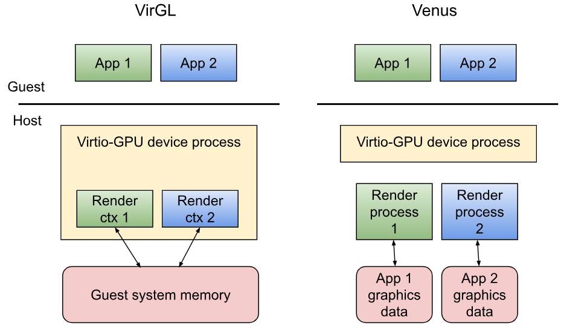

ChromeOS is the most secure consumer OS currently on the market. It employs an extremely extensive defence-in-depth security model. 

**NOTE: These docs are still under active development.**

## Update Cycle

ChromeOS follows the weekly Chrome release cycle.[1](https://security.googleblog.com/2023/08/an-update-on-chrome-security-updates.html) This can be verified by checking the [Chrome updates page](https://chromereleases.googleblog.com/search/label/Stable%20updates) which shows ChromeOS getting weekly stable updates.

## Android Runtime on ChromeOS (ARCVM)

ChromeOS has undergone significant advancements in running Android apps through three iterations of Android Runtime for ChromeOS (ARC)[2](https://chromeos.dev/en/posts/making-android-runtime-on-chromeos-more-secure-and-easier-to-upgrade-with-arcvm#what-is-arc):

- ARC (2014): The initial version relied on Native Client ([NaCl](https://developer.chrome.com/docs/native-client/)), requiring app recompilation and limiting users to a curated selection by Google.

- ARC++ (2016): This iteration introduced containerization using Linux Kernel features like [cgroups](https://en.wikipedia.org/wiki/Cgroups) and [namespaces](https://en.wikipedia.org/wiki/Linux_namespaces). This allowed unmodified Android apps to run in an isolated environment and opened the door for the Google Play Store on Chromebooks.

- ARCVM (2021): The latest and most advanced version leverages virtual machines (VMs) to completely isolate Android apps from the underlying ChromeOS by utilizing [crosvm](#crosvm).

The image below showcases the architectural differences between ARC++ and ARCVM.

ARCVM achieves a clean separation between ChromeOS and Android by running Android within a virtual machine (VM). This isolation reduces dependencies and simplifies updates for each system. Let’s look at the ARCVM kernel as an example.

### ARCVM Kernel

> The ARCVM kernel is a single, unified kernel (available for both x86_64 and aarch64 architectures) that comes bundled with ARCVM. It's a customized version of the Android Common Kernel (ACK) with specific patches to ensure smooth integration with the host OS (ChromeOS in this case). An example of such a patch is Virtio support for Wayland, which facilitates graphics communication.
> 
> [source](https://chromeos.dev/en/posts/making-android-runtime-on-chromeos-more-secure-and-easier-to-upgrade-with-arcvm#simplicity-means-upgradability)

While Google doesn't publicly disclose the specific hardening measures implemented in the ARCVM kernel, the open-source nature of ChromiumOS, the foundation for ChromeOS, provides valuable insight. By examining the [ChromiumOS ARCVM git repos](https://chromium.googlesource.com/chromiumos/third_party/kernel/+/refs/heads/chromeos-5.10-arcvm), we can identify the security features incorporated into the kernel.

These features will be documented to the best of our ability in the future.

### Venus

> Venus is an efficient framework for virtualized Vulkan, providing the accelerated Vulkan API to ChromeOS guest VM applications. Venus has a lightweight guest-side implementation that streams Vulkan API calls into a shared memory buffer that the host-side renderer asynchronously consumes. Its predecessor, VirGL, in contrast has a guest-side driver that interprets OpenGL calls to synchronously return OpenGL state and error results at the expense of additional CPU overhead.This causes a performance hit twice, once when the renderer interprets and submits those commands to the host, and again for error checking and state tracking, as required by [the spec](https://www.khronos.org/registry/OpenGL/index_es.php).
> 
> One of the big design changes from VirGL is Venus’s process isolation. In the event of an attack on the host through the guest graphics API, the Venus architecture limits the attack to the guest application’s own graphics data as opposed to the guest OS’s system memory.
> 
> [source](https://chromeos.dev/en/posts/improving-vulkan-availability-with-venus)

Venus is used for the graphics API in borealis and [ARCVM](#android-runtime-on-chromeos-arcvm).

### Future ARCVM Work

> Using KVM-based VMs on battery-powered devices like Chromebook is not common and still has some unexplored areas that we can improve.
>
> For example, memory usage optimization is critical since our devices have far less RAM than traditional KVM deployments on massive servers. Applying [multi-generational LRU](https://www.phoronix.com/scan.php?page=news_item&px=Linux-Multigen-LRU) (MGLRU) was a huge win for our memory usage.
>
> Additionally, we have an experimental project called [ManaTEE](https://www.youtube.com/watch?v=BD_lcnkNAk4&t=508s) which pushes VM usage forward and provides software-based Trusted Execution Environments (TEEs) without dedicated TEE hardware. This opens up an opportunity for us to store data which should not be exposed even to the host OS, such as biometrics and encryption keys.
>
> [Source](https://chromeos.dev/en/posts/making-android-runtime-on-chromeos-more-secure-and-easier-to-upgrade-with-arcvm#future-work)

Manatee is under active development by Google, but as of June 23, 2024 it is not yet used in production. For those interested, take a look at the [ChromiumOS ManaTEE git repo](https://chromium.googlesource.com/chromiumos/third_party/kernel/+/refs/heads/chromeos-5.10-manatee).

## Core Scheduling

Recent CPU vulnerabilities, particularly those targeting hyperthreading, have highlighted security risks. The discovery of [Microarchitectural Data Sampling (MDS) attacks](https://mdsattacks.com/), like [Rogue In-Flight Data Load (RIDL)](https://mdsattacks.com/files/ridl.pdf) and [fallout](https://mdsattacks.com/files/fallout.pdf), allows malicious actors to exploit weaknesses within a CPU core. These attacks enable one hyperthread to glean sensitive data from another by analyzing side-channel information. While disabling hyperthreading is a typical defense against such vulnerabilities, it often comes at the expense of processing speed.[3](https://chromeos.dev/en/posts/improving-chromeos-performance-with-core-scheduling) Google's bug hunters blog has an [excellent writeup on MDS attacks](https://bughunters.google.com/blog/4712170091839488/no-more-speculation-exploiting-cpu-side-channels-for-real) for those that want to learn more about MDS vulnerabilities.

While a brute-force approach of disabling the vulnerable functionality might appear effective for mitigating CPU vulnerabilities, it often incurs a substantial performance penalty.

## Crosvm

ChromeOS utilizes crosvm, a lightweight virtual machine monitor (VMM), to securely run both Linux applications and Android environments. Prioritizing security, crosvm isolates these untrusted environments within sandboxes. Written in Rust, a memory-safe language, crosvm minimizes the risk of vulnerabilities. Each virtual device, like disks and network interfaces, runs within its own minijail sandbox, further restricting potential exploits. This multi-layered approach ensures that even a compromised Linux instance or Android container cannot escape the sandbox and harm the core ChromeOS system. Crosvm strengthens this security by enforcing a syscall security policy, meticulously controlling which system calls guest Linux devices and Android containers can execute.[4](https://crosvm.dev/book/introduction.html)

## Venus

Venus is the

